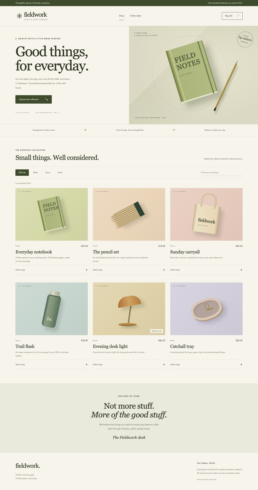

# Fieldwork Supply

A working synthetic shop explores the useful boundaries and operational costs of webpack 5 Module Federation. React powers independently built catalog and cart experiences, with an Express API handling stock and checkout.

Browse a six-product collection, filter and search, edit a saved bag, place an idempotent demo order, and fulfill it at the order desk. Separately built catalog and cart remotes can fail without taking down navigation. API and checkout failures preserve the bag and offer recovery.



## Run locally

Use Node 22 or newer; Node 22 is the CI target. The actual local runtime and measured results are recorded in [verification.md](verification.md).

```sh
npm ci
npm run build
npm start
```

Open **http://127.0.0.1:4310**. Host: 4310; catalog: 4311; cart: 4312; API: 4313. All listeners bind to loopback. `npm run dev` builds once and starts the same production bundles; it is deliberately not an HMR development server. Stop with Ctrl+C, rebuild after source edits.

The catalog, order names and fulfillment actions are synthetic. Enter a made-up name only. No money changes hands and no email, payment, shipping or external service is contacted. API data lives in memory and resets on restart. Set `COMMERCE_ADMIN_TOKEN` to enable the optional local admin capability. The order desk supports filtered pages, fulfillment, confirmed cancellation, inventory counts and an activity trail.

## Verify

```sh
npx playwright install chromium
npm run verify
npm run benchmark -- --output /tmp/fieldwork-benchmark-run --samples 3
```

`verify` checks TypeScript, HTTP integration tests, all three production bundles and the isolated `tests/e2e` Chromium suite. Every browser test starts its own four-service runtime and fresh store, then drains it on teardown. Stop `npm start` first. API tests create isolated stores. Set `COMMERCE_WORKERS=2` to run files concurrently: workers use separate port ranges in increments of 10 from `COMMERCE_TEST_PORT_BASE` (4310 by default). Screenshots go to per-test output directories; recorded evidence remains untouched.

The benchmark rebuilds an eager-cart baseline and an on-demand-cart version, measures build and generated asset sizes, then captures three cold browser contexts for each variant. It requires a new output directory, records source identity and distributions, and preserves existing evidence. It leaves no benchmark server running. Stop other processes on ports 4310–4313 before running it. See [the experiment report](docs/performance.md) for observed results and limits.

## Source map

| Path | Responsibility |
| --- | --- |
| `apps/host` | Navigation, cart persistence, checkout, order desk, API recovery and remote boundaries |
| `apps/catalog` | Federated collection, filters, product cards |
| `apps/cart` | Federated cart lines, quantities, subtotal |
| `apps/api` | Catalog, server-owned stock/prices, checkout receipts, fulfillment |
| `packages/contracts` | TypeScript wire/component contracts and money/shipping helpers |
| `webpack.config.cjs` | Three independent builds, React singleton contracts, baseline switch |
| `tests/unit`, `tests/e2e` | HTTP invariants and real-browser journey/failure evidence |
| `scripts` | Loopback service lifecycle and benchmark runner |

[Architecture and sequence diagrams](docs/architecture.md) · [ADR and alternatives](docs/adr/001-federation-and-local-state.md) · [Operations and failure exercises](docs/runbook.md) · [Dependency provenance](docs/provenance.md) · [Verification evidence](verification.md)

## What this demonstrates—and its limits

The runnable evidence covers remote composition, shared React, independent failure handling, authoritative checkout totals, concurrent duplicate suppression in one process, transport retry, and a comparison of early versus deferred cart loading. It does not establish production reliability, durable or distributed transactions, security certification, payment correctness, or real-world conversion/performance improvements. Angular, Nx and Next.js extensions are deliberately outside this implementation.

Original application code and CSS artwork are [MIT licensed](LICENSE). Dependency licenses remain with their owners.

Optional engine coverage: `npx playwright install firefox webkit`, then `COMMERCE_BROWSERS=all npm run test:e2e -- --grep critical`. Firefox and WebKit run the critical purchase and keyboard journeys; Chromium runs the complete suite by default. The CI manual workflow exposes the same optional check.
