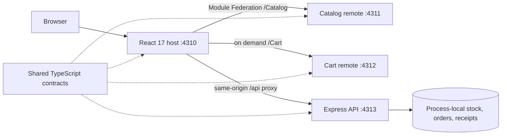
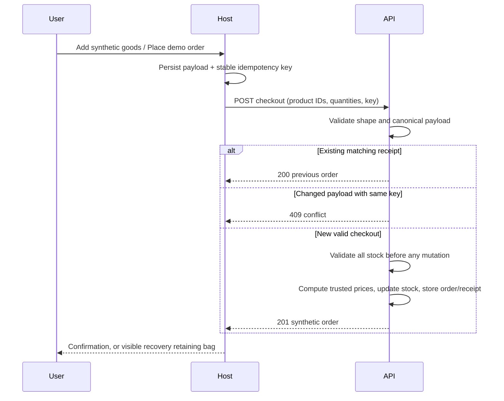

# Architecture

Each frontend has an independent webpack compilation, runtime identity, output directory and HTTP origin. Module Federation shares one strict React 17 singleton. The async host bootstrap allows share-scope initialization before React consumption. The catalog remote renders filters and product presentation while the host retains filter state; the cart remote owns line presentation. The host owns cart state, navigation, checkout, order desk and data fetching. No shared mutable global event bus is needed: typed props/callbacks make ownership explicit.

The optimized host loads the cart component when the user opens the bag. webpack may still discover its container entry during startup share-scope initialization. The benchmark baseline eagerly imports the same component at startup. Both expose exactly the same experience and use the same dependency versions; the comparison isolates when the cart bytes are requested.

Navigation and checkout inputs are disabled while submission is in flight or its outcome is uncertain, so a delayed response cannot clear items added to a different bag.

Money is integer US cents. Shipping is $6 standard, free standard from $75, or $12 express. The API trusts its own product prices only. Quantity is an integer from 1 to 10; duplicate and unknown product IDs and unknown request fields are rejected. Idempotency records include a canonical payload fingerprint with fixed item property ordering and the original order. A changed payload requires a new key. Retry checks occur before stock availability, so a successful order can replay even if the purchase exhausted stock.

All stock/order/receipt mutations happen synchronously between validation and response inside a single Node process. This is sufficient for the demonstrated local concurrency test, not a distributed transaction. A production version needs a database transaction, a unique constraint on idempotency keys, expiry/retention policy, authorization, audit logging and an actual payment provider.

The demo servers bind only to `127.0.0.1`. The order desk can require a local capability, and all server state resets when the service restarts. This is a local learning artifact, not a deployable commerce service. All data is synthetic, with no card form or external service.

Remote load/render failures are contained by separate error boundaries, preserving host navigation. A failed catalog offers reload; a failed cart shows the saved item count and subtotal with reload. Remote retry creates a fresh lazy boundary and retries the failed container without discarding host state. Runtime configuration restricts remote entries to the configured loopback service origins. API fetches have bounded timeouts and visible retry; an ambiguous checkout response retains the original request/key for a safe replay.

Official references: [webpack Module Federation](https://webpack.js.org/concepts/module-federation/), [webpack 5 release](https://webpack.js.org/blog/2020-10-10-webpack-5-release/), [React 17 release](https://legacy.reactjs.org/blog/2020/10/20/react-v17.html).
